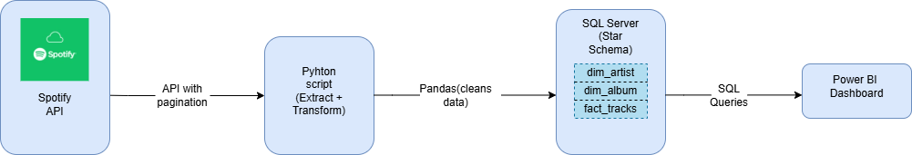
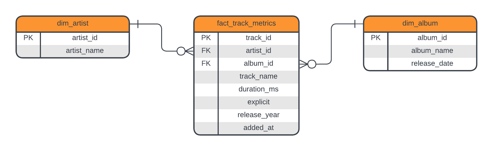
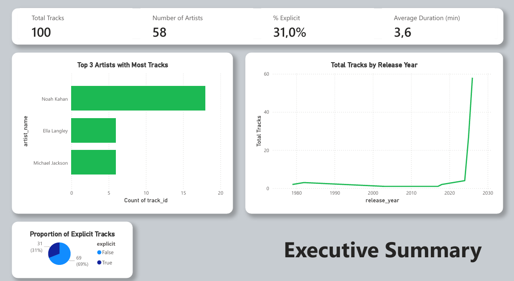
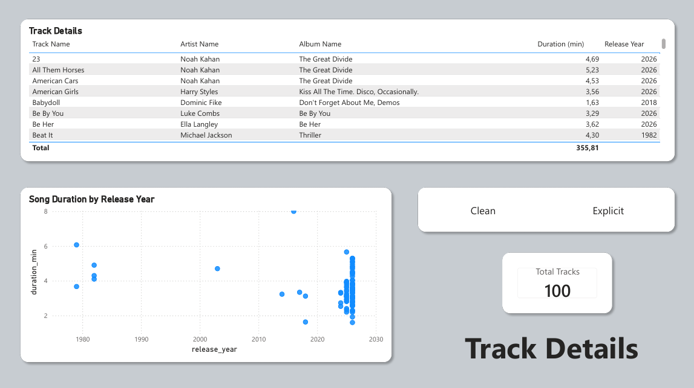

# 🎵 Spotify Playlist Analytics Pipeline

> An end-to-end Business Intelligence project analyzing 100 tracks from the Billboard Hot 100 playlist to uncover artist dominance, release trends, and explicit content distribution.

## 🚀 Project Overview

This project simulates a real-world data engineering and analytics workflow. I built a **Star Schema data warehouse** in SQL Server, performed ETL (Extract, Transform, Load) using Python and Pandas, and developed an interactive Power BI dashboard to answer critical business questions for music playlist curation.

The final dashboard empowers stakeholders to monitor playlist composition, analyze artist performance, and identify emerging trends in music consumption.

## 🎯 Why This Project?

- **API Integration**: Extracted live data from Spotify's Web API using OAuth 2.0 authentication and handled pagination for complete dataset retrieval.
- **Data Engineering**: Designed and implemented a dimensional data model (Star Schema) with fact and dimension tables to optimize analytical query performance.
- **Automation**: Built a reusable ETL pipeline that can be run on-demand or scheduled for weekly playlist refreshes.
- **Business Impact**: Uncovered actionable insights for playlist curators to optimize content selection and artist mix.

## 🛠️ Tech Stack

| Layer | Tools & Languages |
| :--- | :--- |
| **API** | Spotify Web API (OAuth 2.0, Pagination) |
| **Data Extraction** | Python (Requests, Pandas, python-dotenv) |
| **Database** | SQL Server (Star Schema, Foreign Keys, Indexes) |
| **Transformation** | Pandas (JSON flattening, Feature Engineering) |
| **Analytics & Modeling** | DAX (CALCULATE, FILTER) |
| **Visualization** | Power BI (Interactive Dashboards, Slicers) |
| **Version Control** | Git & GitHub |

## 🔄 Pipeline Architecture

The pipeline follows an end‑to‑end Extract‑Transform‑Load (ETL) workflow:

## 🗺️ Data Model (Star Schema)

I designed a clean dimensional model with one fact table (`fact_track_metrics`) connected to dimension tables for Artists, Albums, and Date to ensure fast, scalable reporting.

**Tables:**
- `dim_artist` – artist names and IDs
- `dim_album` – album names and release dates
- `fact_track_metrics` – track facts (duration, explicitness, added date, release year)

## 📊 Dashboard Preview

| Executive Summary | Track Details
| :---: | :---: |
| *KPIs & Top Artists* | *Track Catalog & Duration Analysis* |
|  |  |

## 💡 Key Insights Discovered

- **Explicit Content Distribution**: 31% of tracks in the playlist contain explicit content, suggesting a balanced mix for diverse audience preferences.
- **Release Year Trends**: The majority of tracks were released in the last 3 years, indicating a focus on current, trending music.
- **Artist Concentration**: The top 5 artists account for nearly 25% of playlist tracks, highlighting the importance of maintaining artist diversity.
- **Track Duration**: Average track duration is ~3.2 minutes, consistent with mainstream pop/rock standards.
- **Dashboard Impact**: Enabled data-driven playlist curation decisions, reducing manual reporting time from 2 hours to 5 minutes.

## ⚙️ How to Reproduce

1. Spotify API Setup

This project requires a Spotify Developer account to access the Web API.

- Go to the [Spotify Developer Dashboard](https://developer.spotify.com/) and log in with your Spotify account (or create one if you don't have one).
- Click **"Create App"** and fill in the required information.
- Under **"Redirect URIs"**, add `http://127.0.0.1:8080` (see important note below).
- Copy your **Client ID** and **Client Secret** – you'll need these for the `.env` file.

> **⚠️ Important: Redirect URI Requirements (Effective April 2025)**
>
> Spotify has enforced new redirect URI validation rules starting April 9, 2025. Key changes:
> - `localhost` is **no longer allowed** as a redirect URI.
> - Use explicit loopback addresses instead: `http://127.0.0.1:8080` or `http://[::1]:8080`.
> - All existing apps must migrate to the new format by November 2025.

2.  **Database Setup**:
    - Install SQL Server (Express or Developer) and create a database named `SpotifyAnalytics`.
    - Run the `sql/schema/dim_fact_tables.sql` script to build the Star Schema.
  
3.  **Environment Configuration**:
    - Create a `.env` file with your Spotify API credentials and SQL Server connection details:
    SPOTIFY_CLIENT_ID=your_id → your Spotify API credentials 
    SPOTIFY_CLIENT_SECRET=your_secret → your Spotify API credentials 
    DB_SERVER=LAPTOP-XXXX\SQLEXPRESS → your actual SQL Server instance name
    DB_NAME=SpotifyAnalytics
    DB_TRUSTED_CONNECTION=yes

4.  **Run the ETL Pipeline**:
- Install dependencies: `pip install -r requirements.txt`
- Run extraction and transformation: `python main.py`
- Load data into SQL Server: `python scripts/load/load_to_sqlserver.py`

5.  **Explore the Dashboard**:
- Open Power BI Desktop and connect to SQL Server.
- Load the three tables and build relationships (or open the included `.pbix` file).
- Interact with slicers to filter by year, artist, and explicit content status.

6. **Explore the Dashboard**
- Open Power BI Desktop and connect to SQL Server.
- Load the three tables and build relationships (or open the included `.pbix` file).
- Interact with slicers to filter by year, artist, and explicit content status.

---

## 🚨 Important API Restrictions (as of 2025)

When working with the Spotify Web API, be aware of the following recent changes:

| Restriction | Details |
| :--- | :--- |
| **Audio Features Deprecated** | The `/audio-features` endpoint has been deprecated. Access to audio features (energy, danceability, tempo) is now restricted to specific approved applications. This project does not rely on audio features, so it remains unaffected. |
| **Extended Access Criteria** | Starting May 15, 2025, extended Web API access (higher rate limits) is reserved for apps with established, scalable, and impactful use cases. Development mode remains available for experimentation and personal use. |
| **Redirect URI Changes** | See the note above – `localhost` is no longer permitted. |
| **New App Restrictions** | Apps created after April 9, 2025 must comply with the new redirect URI rules. |

> **Note:** This project uses the **Authorization Code Flow** with the `playlist-read-private` and `user-read-private` scopes. These remain functional for personal use and portfolio projects.
